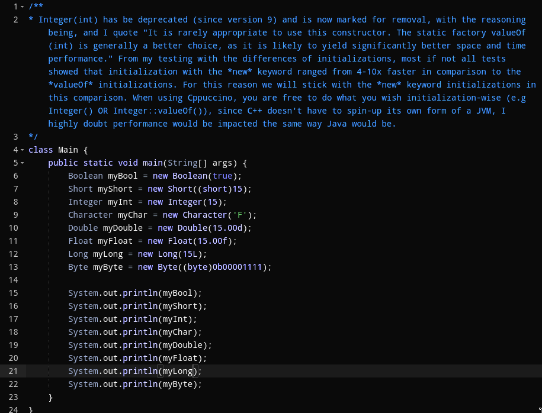
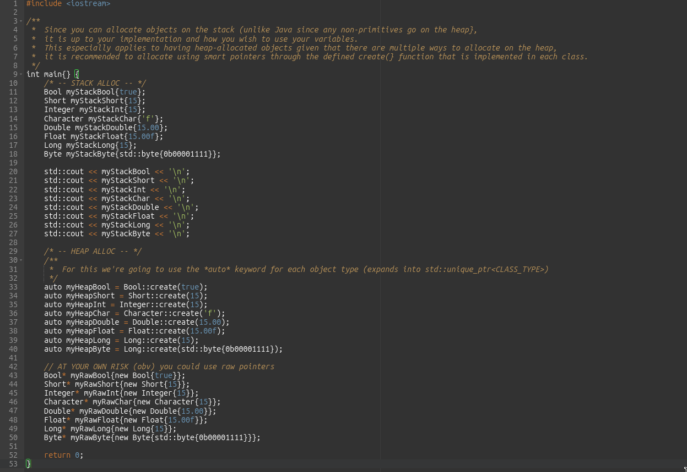

# Cppuccino

C++ Implementation of Java Wrapper Classes of Primitive Types

## About

As the short title description suggests, this project aims to provide a new sense of usability when it comes to primitive types in the same similar fashion that is given to those programming in Java and their dealings with the relative wrapper classes of primitive types.

## Quick Start

### Prerequisites

- Compiler that supports $\ge$ C++20
- C++: $\ge$ C++20
- CMake: $\ge$ 3.28
- Make

### Installation

1. Clone the repo

   ```sh
   git clone https://github.com/butterbanes/Cppuccino.git
   ```

2. Change to the install directory

   ```sh
   cd Cppuccino
   ```

3. Use CMake to build the project

   ```sh
   mkdir build
   cd build
   cmake ..
   make
   ```

4. Install the library to your system

   ```sh
   sudo make install
   ```

### List of Fully Available Headers

- Integer
- Bool

### Headers Not Yet Implemented

- Byte
- Character
- Double
- Float
- Long
- Short

#### Including The Headers

1. At this point, the library is installed to your system so you can include it the normal way through:

   ```cpp
   #include <Cppuccino/Integer.h>
   ```

   *The same includes go for any of the library headers*

## Comparison

<table>
  <tr>
    <th>JAVA</th>
    <th>C++</th>
  </tr>
  <tr>
    <td></td>
    <td></td>
  </tr>
</table>

## Contributing

Contributions are always welcome! This is an open-source project and I believe it should be treated as such. If you wish to contribute to Cppuccino, take a look at the [CONTRIBUTE](./CONTRIBUTE.md) file. It should have everything you need to know about taking part in this project. 🙂

If you find any bugs or have any other problems make sure to open an issue on GitHub describing what's going on.